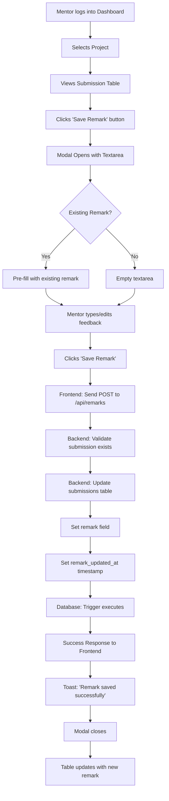
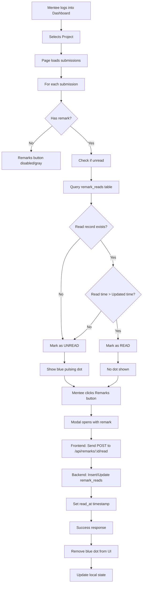
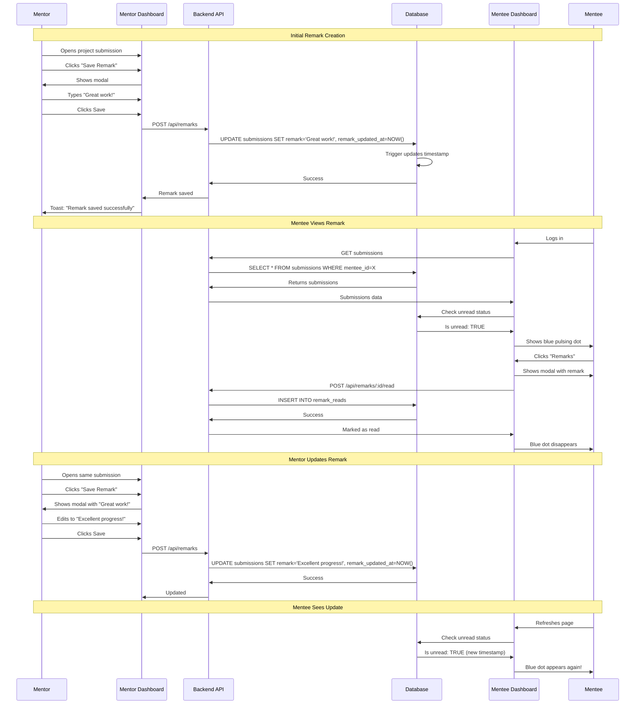
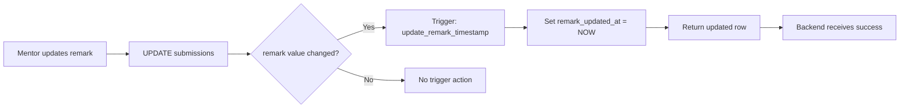
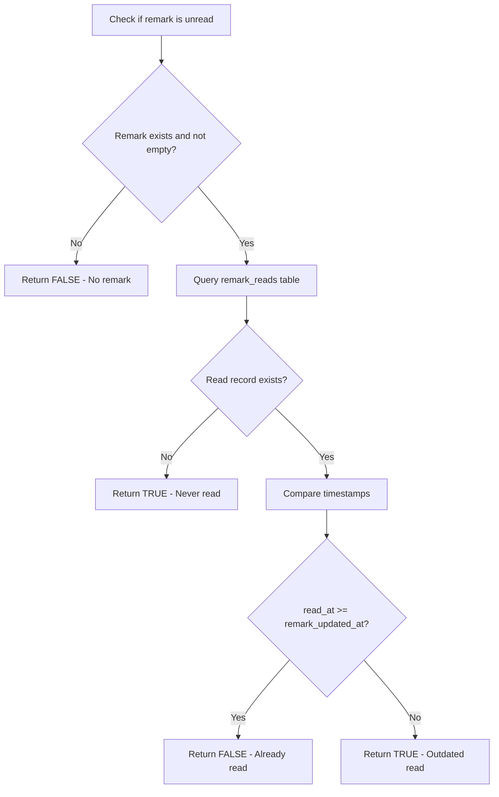
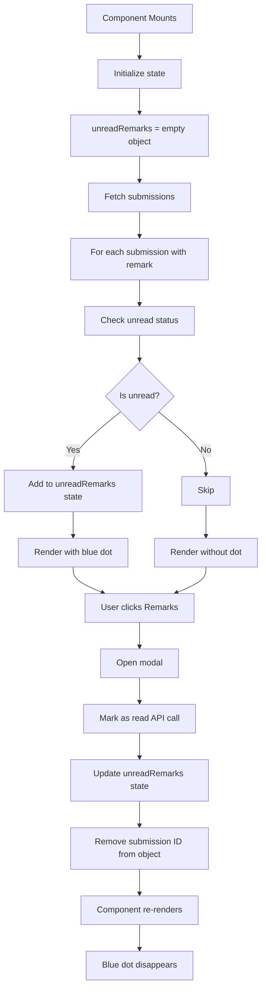
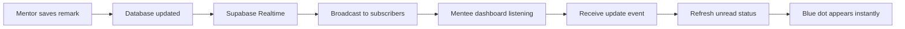

# Remark System - Flow Diagrams

## 📊 System Flow Overview

### 1. Mentor Adds/Updates Remark



### 2. Mentee Views Remark (First Time)



### 3. Complete Interaction Cycle



### 4. Database Trigger Flow



### 5. Unread Status Check Algorithm



### 6. State Management (React)



## 🎯 Key Decision Points

### When to Show Blue Dot?

```
IF (submission.remark IS NOT NULL AND submission.remark != '')
    AND (
        no read record exists
        OR read_at < remark_updated_at
    )
THEN show blue dot
ELSE hide blue dot
```

### When to Auto-Update Timestamp?

```
IF (NEW.remark IS DISTINCT FROM OLD.remark)
THEN NEW.remark_updated_at = NOW()
```

### When to Enable Remarks Button?

```
IF (submission exists AND submission.remark IS NOT NULL AND submission.remark != '')
THEN enable button (yellow)
ELSE disable button (gray)
```

## 📱 User Experience Flow

### Mentor Experience

```
1. Login → 2. Select Project → 3. View Submissions
                                        ↓
4. Click "Save Remark" → 5. Type Feedback → 6. Click Save
                                        ↓
7. See Success Toast → 8. Modal Closes → 9. Continue work
```

### Mentee Experience

```
1. Login → 2. Select Project → 3. See Blue Dot 🔵
                                        ↓
4. Click "Remarks" → 5. Read Feedback → 6. Close Modal
                                        ↓
7. Blue Dot Gone ✓ → 8. Continue work
```

## 🔄 Real-time Updates (Future Enhancement)



## 🎨 Component Hierarchy

```
MenteeDashboard
├── Project Selector
├── Project Info Card
└── Submission Stages Grid
    └── For each stage:
        ├── Stage Card
        │   ├── Stage Header
        │   ├── File Info (if uploaded)
        │   │   ├── Filename
        │   │   ├── Upload Date
        │   │   └── Status Badge
        │   └── Action Buttons
        │       ├── View Button
        │       ├── Remarks Button
        │       │   └── Blue Dot (conditional)
        │       └── Delete Button
        └── Upload Area (if not uploaded)

Remark Modal (conditional)
├── Header
│   ├── Title
│   ├── Stage Label
│   └── Close Button
├── Body
│   └── Remark Content Card
│       ├── Icon
│       └── Feedback Text
└── Footer
    └── Close Button
```

## 🗂️ Data Flow

```
Database (Supabase)
    ↓
Backend API (Express.js)
    ↓ JSON
Frontend State (React useState)
    ↓
UI Components (JSX)
    ↓
User Interface (Browser)
```

---

**Visual Reference**: Use these diagrams to understand how the remark system works end-to-end.

**Note**: The mermaid diagrams above can be rendered in any markdown viewer that supports mermaid syntax (GitHub, GitLab, VS Code with extensions, etc.)
